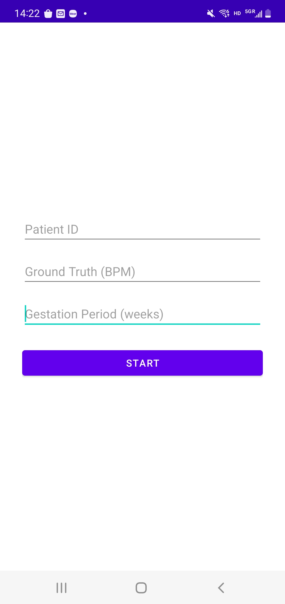
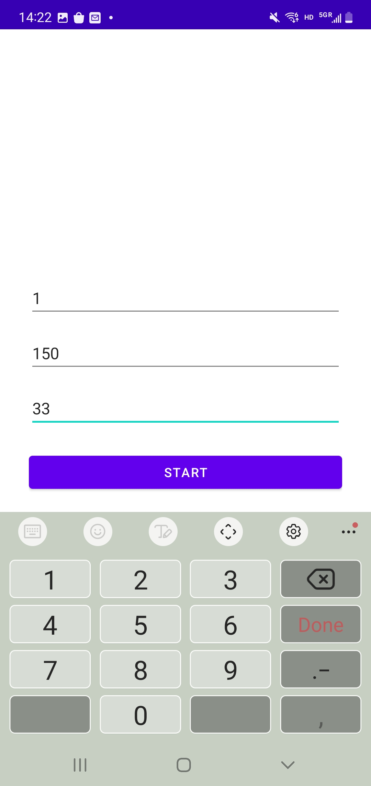
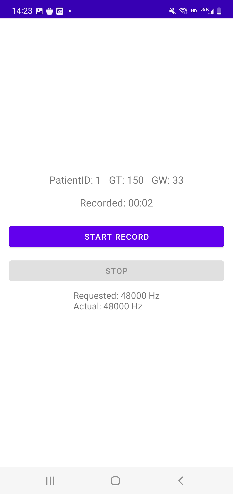
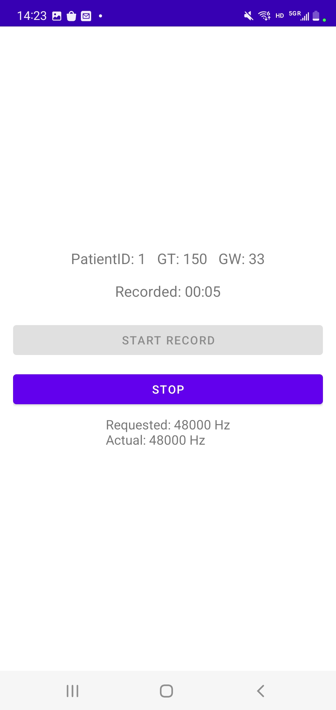
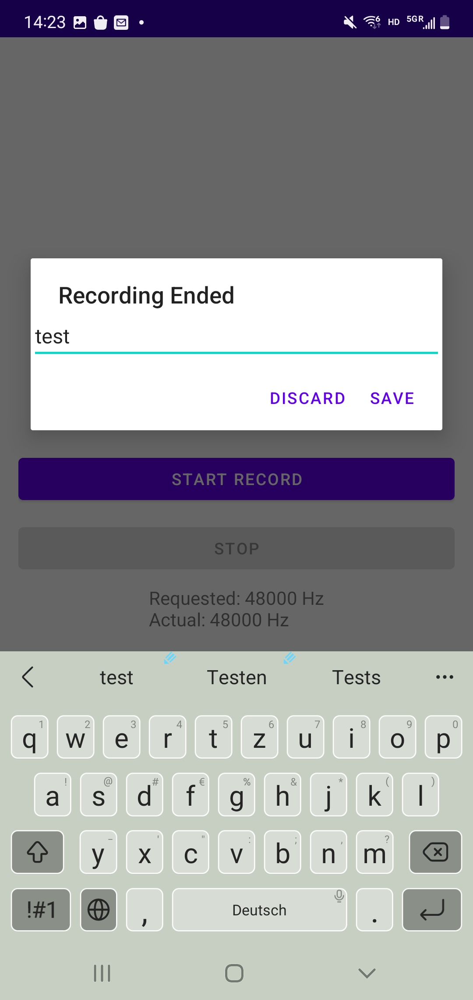
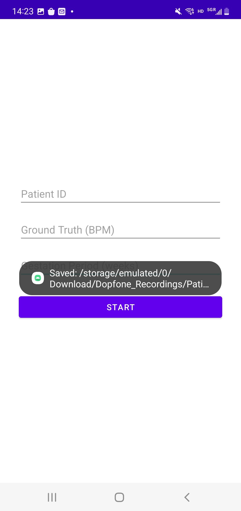

# Fetal Health Monitoring App (Android)

## Objective
The goal of this research is to build an easy-to-use system for ubiquitous at-home monitoring of fetal health by pregnant women. This study will recruit 40 currently pregnant women. We will collect audio data from the mobile phone (i.e. reflections from the ultrasound signal emitted by the mobile device's speaker). All the participant's data will be de-identified and coded for analysis. 

## Backend
The Android version of the App is built in Android Studio Chipmunk (2021.2.1) using Kotlin 1.8 and targets API level 33. It runs on Android 12 and above, allowing clinicians to use their personal Android device to non‐invasively capture Doppler audio. During data collection, the user launches the app, positions the phone’s speaker against the expectant mother’s abdomen, and taps “Start.” The app simultaneously plays an 18 kHz inaudible tone through the speaker and records the reflected sound via the device microphone at a 48 kHz sampling rate. When the session ends, the raw audio is saved locally as a WAV file and cataloged in a CSV log for later analysis.

## Prepare to use the App
There are two methods to help you get prepared for our app. You can either download the apk file in this repo directly or download the DopFone folder which allows you to modify the contents inside to be more customized. Below are more detailed instructions.
### Method 1
1. Download [app-release.apk](/app-release.apk)
2. Open the file and allow Microphone access
3. You are all set. Enjoy using ~
### Method 2
#### PC prep
1. Download [Android Studio]([url](https://developer.android.com/studio))
2. Download [DopFone folder](/DopFone) in the repo
3. Open DopFone folder inside Android Studio
#### Phone prep
1. Open **Settings → About phone/device**. Find **the Build numbe**r (or MIUI version, EMUI version, etc.) and tap it 7 times. You’ll see “You are now a developer!”
2. Go back to **Settings → System (if needed) → Developer options.**
3. Scroll down and turn on USB debugging. If a warning pops up, tap OK.
4. Connect your phone with a **data-capable** USB cable
5. On the phone, you may see a “USB for” notification—set the connection mode to File transfer (MTP) or Transferring files.
6. You’ll get a “Allow USB debugging?” prompt on the device—tap Allow (you can tick “Always allow from this computer” so you don’t get asked again).
7. In Android Studio, look in the toolbar’s device selector dropdown (to the left of the green ▶️). Your phone should appear by its model name (e.g. “Pixel 5” or “SM-G991U”). If it doesn’t show up, click the Refresh icon next to that dropdown.
8. Once your device is listed, select it in the dropdown. Hit the ▶️ Run button.

## How to use the App (Here is the [video tutorial.mp4](Video Tutorial.mp4) showing the whole operation pipeline)
1. **Remember to turn your volume to the highest.**
2. The first screen presents a text-entry page for the doctor to enter the custom-assigned **Patient ID** at the time of the consent process, the **Ground Truth** collected by the medical professional before using the device by using the gold standard device, and the **Gestation Period** of the pregnancy. After filling in all the information, hit the **Start** button. It will jump to the second screen.

   
     
3. The second screen is for data collection and will reflect the default sampling rate of the mic on your phone (this may vary from devices because of different hardware). On hitting the 'Start record' button, the ultrasound audio transmission as well as audio recording starts together to collect the reflections from the ultrasound signal emitted by the mobile device's speaker. There is a timer showing the recording time. There is also a stop button to stop the recording anytime while the session is going on. On the bottom, the requested sampling rate means the sampling rate set by the software, which is explicitly listed as 48kHz in the codes, while the actual sampling rate means the sampling rate restricted by the mic itself. When these two values mismatch, the recording will be sampled at the actual sampling rate instead of the requested sampling rate.

   
     
4. The last page records comments from the doctor regarding the data collection session and redirects to either the first page if the data was saved or the second if the data was discarded and the medical professional would like to re-record the data. All the saved files will be stored in **Internal Memory/Download/Dopfone_Recordings**. To fetch the files, you can either use the default 'File' app on your phone or download a third-party app and grant it access to your files (such as Solid Explorer).

   
     

## Android Phone Comparison
We tested our app on several different Android phones to have an understanding of the difference between their audio-related hardware. For the tested phones, the actual sampling rate of all matches the requested sampling rate (48kHz). Other than comparing different devices, we also tested how volumes impact the spectrogram of the recordings on each device. Below are the spectrograms of the results. Some of the spectrograms have multiple bright lines. This is due to playback distortion because some of the speakers cannot reproduce high-frequency tones cleanly at high amplitude. By decreasing the volumes, some of the lines will disappear while 18kHz still persists. The first spectrogram is from the recording when the volume is 100%, while the second is 50%.
### Google Pixel 3
We can observe that the 12kHz line disappears and the 6kHz line becomes darker after reducing the volume.

   
     
### HUAWEI Mate50 Pro
We can observe that the 12kHz and 6kHz lines nearly disappear after reducing the volume.

   
     
### Samsung Galaxy Note10+
Both spectrograms only have 18kHz bright horizontal lines.

   
     
### Samsung Galaxy S22
Both spectrograms only have 18kHz bright horizontal lines.

   
     
### Google Pixel 3
Both spectrograms only have 18kHz bright horizontal lines.

   

## Features of the App
### The App Inputs:
1. Patient ID (text entry from the doctor).
2. Ground Truth (text entry from the doctor).
3. Gestation period (text entry from the doctor).
4. Microphone audio is collected through the app.
5. Comments from the medical professional regarding whether the data should be saved or discarded(text entry from the doctor).
### The App Outputs:
1. The app shows a timer running while the audio is being collected.
2. The phone's speaker transmits a 16-bit sine wave at 18kHz that falls under the ultrasound category of sound for the fetal heart rate analysis.

**Note:** The app **is not** intended to show the predicted values of the fetal heart rate to the user to avoid false positives.

## Data Processing
The app at the time is solely used for data collection purposes, and the data processing is done asynchronously by the researchers using a separate Python file after the data collection is over.
